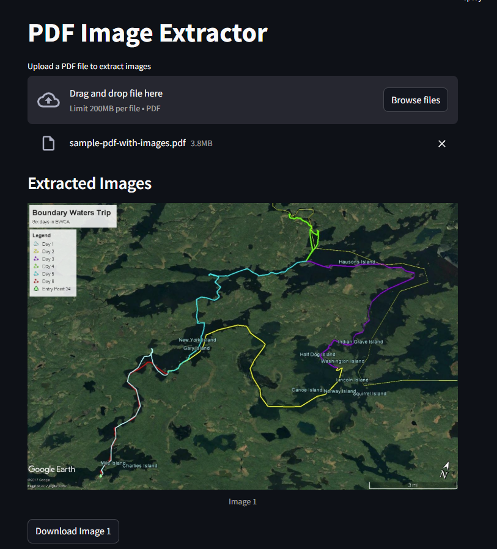

# PDF Image Extractor - Streamlit Version

This repository contains the Streamlit-based version of the **PDF Image Extractor**. It allows users to upload PDF files, extract images from them, and display the extracted images directly in the web application.

 

## Features
- **Upload PDF**: Users can upload a PDF file from their local machine.
- **Extract Images**: The app extracts images from the PDF.
- **View Images**: Extracted images are displayed in the web interface.
- **Download Images**: Users can download the extracted images.

## How to Run

Follow the steps below to run this application locally:

### 1. Clone the repository
First, clone this repository to your local machine:
```
git clone https://github.com/das-amlan/PDF-Image-Extractor-V2.git
```

### 2. Install dependencies
Navigate to the project directory and install the required dependencies:
```
cd PDF-Image-Extractor-V2
pip install -r requirements.txt
```

### 3. Run the app
Start the Streamlit app by running the following command:
```
streamlit run app.py
```

## Requirements
- Python
- Streamlit
- Pillow
- PyMuPDF

## More Information
For more details, including installation and setup for the Flask-based version of this project, please refer to the [previous repository](https://github.com/das-amlan/PDF_Image_Extractor_Web_App).
